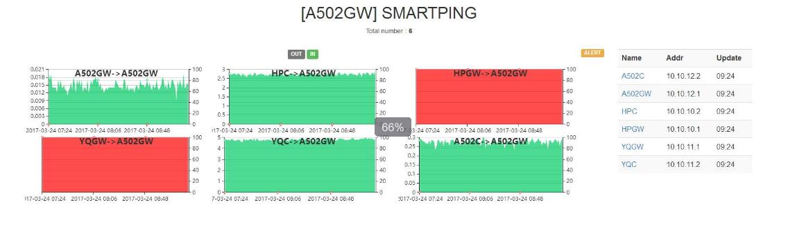
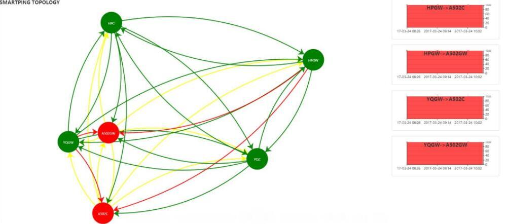

# SMARTPING #
## 介绍 ##
SmartPing为一个各机器(点)间间互PING检测工具，支持互PING，单向PING，绘制拓扑及报警功能

##功能 ##

 - 机器间互PING，单向PING，绘图
 - 绘制互PING间机器的拓扑及报警功能

## 设计思虑 ##
本系统设计为无中心化原则，所有的数据均存储自身点中，默认数据循环保留1个月时间，由自身点的数据绘制出PING包的状态，由各其他点的数据绘制进PING包的状态(此处通过Ajax获取)，并通过全部数据绘制整体拓扑图，拓扑中存在报警功能，报警规则为Thresholchecksec秒钟内存在延迟超过Thresholdavgdelay毫秒或丢包率大于Thresholdloss%即报警，若设置报警声音则会同时有声音提醒。
    
## 配置文件 ##
    {
      "Name": "本机",                   <-本机的标识（支持中文,英文,[中杠，数字]不能开头）
      "Ip": "127.0.0.1",                <-本机的IP
      "Db": "./database.db",            <-数据库
      "Thresholchecksec" : "900",                                           <-报警周期
      "Thresholdloss" : "30",                                               <-报警设置-丢包率
      "Thresholdavgdelay" : "200",                                          <-报警设置-平均延迟
      "Alertsound" : "http://mp3.13400.com:99/1917/001204170042283.mp3",    <-报警声音
      "Tline":"2",                                                          <-拓扑图线宽度
      "Tsymbolsize":"70",                                                   <-拓扑图点大小
      "Targets": [              <-目标机器列表
        {
          "Name": "本机",            <-目标机器名称
          "Addr": "127.0.0.1",       <-目标机器IP
          "Interval": "20",          <-ping检测包数
          "Type":"CS"                <-目标机器模式(C:Client,CS,Client/Server)
        },
        {
          "Name": "洋桥",
          "Addr": "10.10.12.2",
          "Interval": "20",
          "Type":"CS"
        },
        ...
      ]
    }
    
**注意：**

  - 目标机器列表(Targets)中也需要包含本机的信息，否在在拓扑图中将不显示本机
  - PING检测包数需要小于60，目前绘图是一分钟一个点，若高于60将出现断点
  - 目标机器模式,Client代表只接受PING包，不会发送PING包，CS及既发PING包也收PING包，拓扑图中体现为单项连线或双向连线

## 数据库 ##
数据库中存储PING的日志数据，默认循环保留一个月数据，最多（31*24*60=44640条）

    CREATE TABLE pinglog (
        logtime   VARCHAR (20),
        ip        VARCHAR (15),
        name      VARCHAR (15),
        maxdelay  VARCHAR (10),
        mindelay  VARCHAR (10),
        avgdelay  VARCHAR (10),
        sendpk    VARCHAR (10),
        revcpk    VARCHAR (10),
        losspk    VARCHAR (10),
        lastcheck VARCHAR (20),
        PRIMARY KEY (
            logtime,
            ip
        )
    );

## 使用 ##

**运行**

nohup ./idcping &

**访问**

http://ip:8899

**首页示例：**

绿色面积使用左侧坐标轴代表平均延迟，红色面积使用右侧坐标轴代表丢包率

**拓扑示例：**

圆形代表一个点，绿色表示正常，红色表示当前查看拓扑图所在的点到此点不通，连线中绿色代表正常，红色代表异常，黄色代表未知(无法取到数据)

